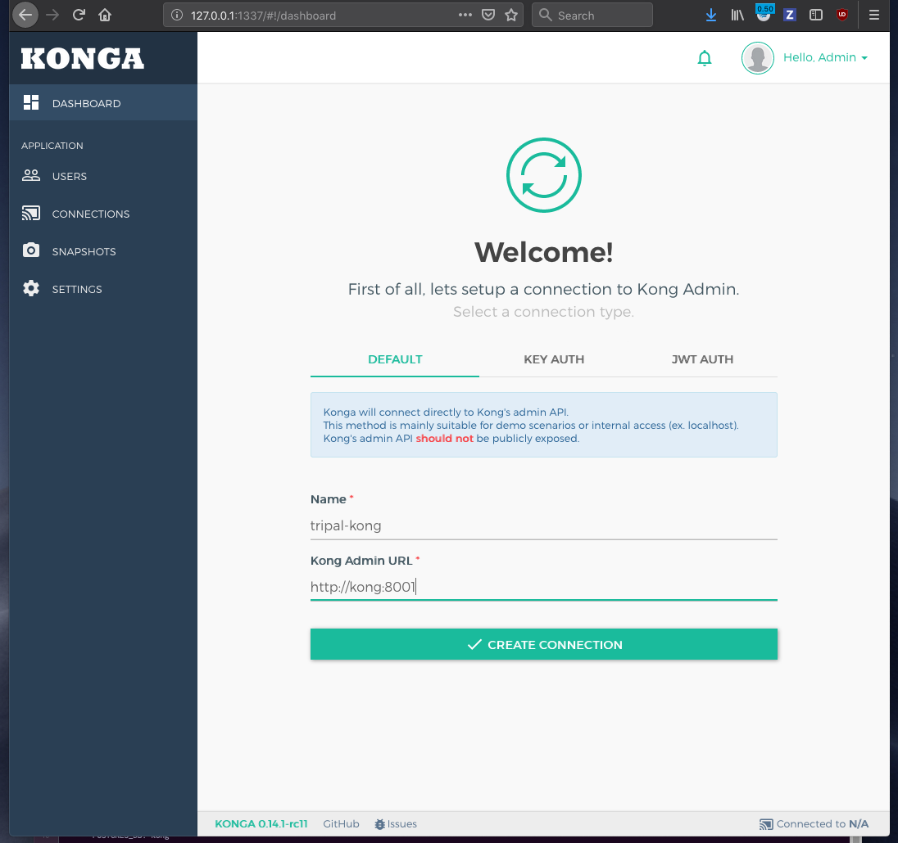
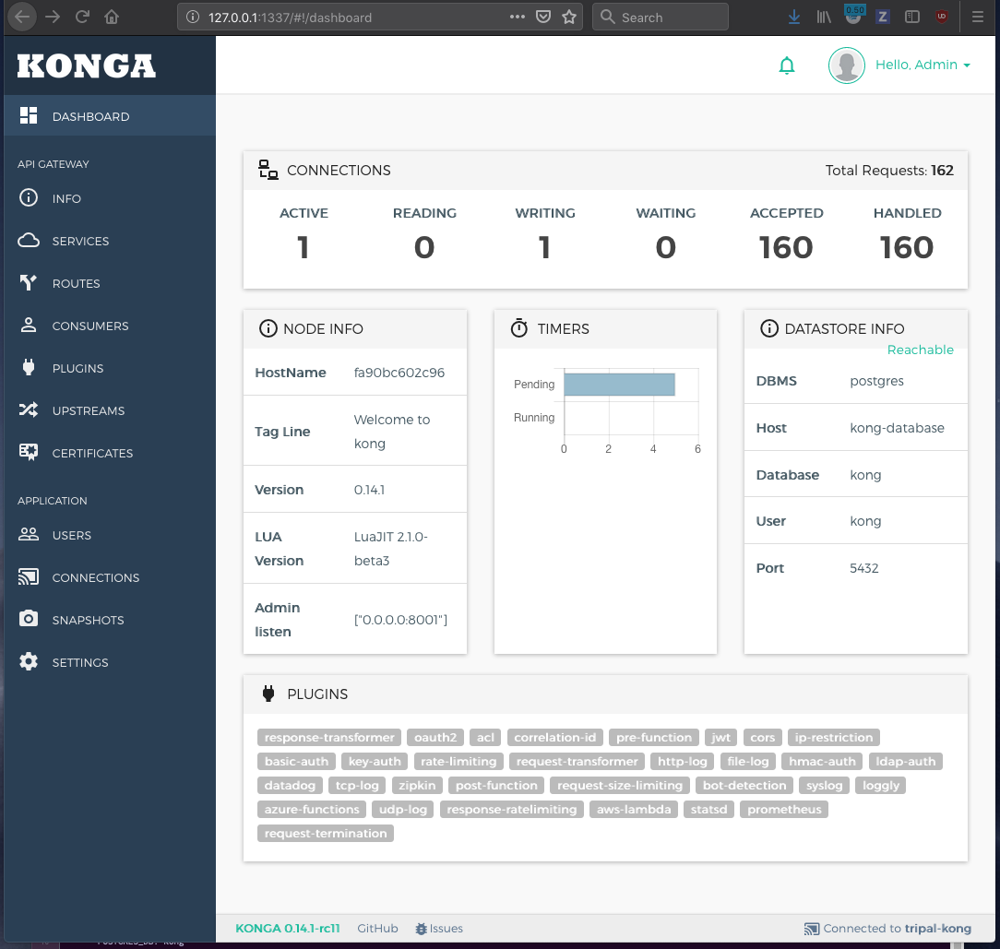
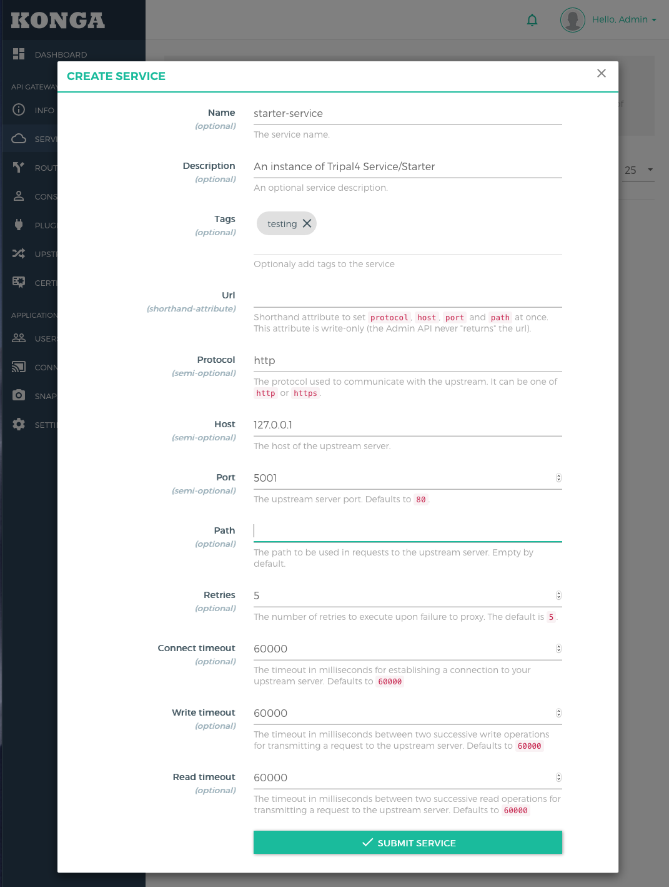
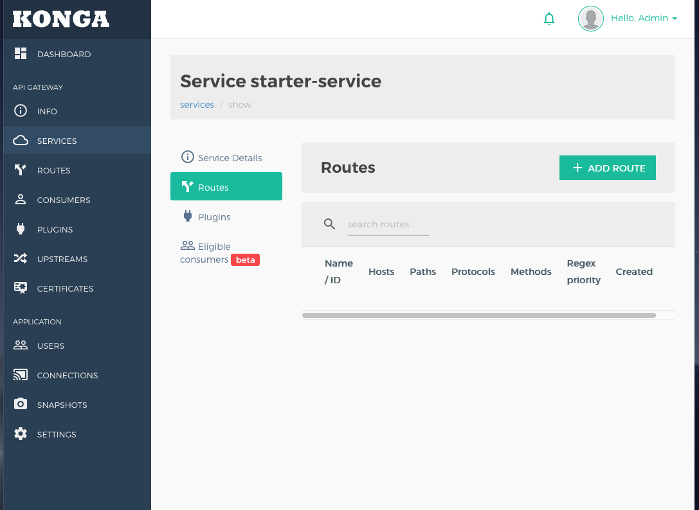

### Getting started with Konga.

Point your browser to port 1337 (default)
and create a new adminstrative user.  

**WARNING: be sure your password is at least 12 characters long and is not the
same as your user name. For example, admin/adminadminadmin is accepted.** If
your password fails to meet the requirements you will simply see an error dump
after creating the account.

**New user account form:**


You should be prompted to login with the recently created user. If instead you 
see an error dump, your username or password did not meet Konga's specifications
(a bug that the developers really should fix....)


You will then be prompted to add a kong instance, by default, the admin
port of kong will be on port 8001.



From here you should be taken to the admin panel for the kong instance
you have set up:



The sidebar options of note are as follows:

| Option | Description |
| ------ | ----------- |
| Info   | Pretty format of same information available at localhost:8001|
| Service | Manage Services |
| Routes | Manage existing routes to services |
| Consumers | Manage user access to routes |
| Plugins | Manage active plugins |
| Upstreams | Manage server connections |

Note that at the moment, kong allows for one route -> one service
but one service can have many routes. Development is in place for
a compositor plugin (one route -> many services) but at the time it
is suggested to write an interface service if you wish for a route to
query multiple endpoints.

Configuration documentation for kong can be found here:
[Kong Documentation](https://docs.konghq.com/1.0.x/getting-started/configuring-a-service/)

## Adding a service
First you must start your service while not required, it is assumed that the
service has been added to the tripal-kong network created by starting this
kong/konga instance via `docker-compose up [-d]`.
** the -d flag dameonizes the containeris and lets them run in the background **

If starting service using docker run:

```
docker run --network=tripal-kong --name=my-service-name ...
```

If starting the service using a docker-compose.yml include the following:

```
networks:
  default:
    external:
     name: tripal-kong
```

Check that the service has been added to the network:
```
docker network inspect tripal-kong
```

The service should now be listed alongside the gateway containers.
Now restart the kong container so that it hosts file is updated:

```
docker restart kong
```
**If you don't want to restart kong** : you can use the IP address of 
the service container as found from inspecting the network, or use the
IP of your computer if the service ports are exposed to the outside
world.


Using the toy service in Services/starter as an example.
Navigate to the directory and start the service if it isn't already up:
```
docker-compose up -d
```
This should start the service as something like `starter-starter-service`
 **Note that the service is listening on port 5000.**  
Verify with:

    $ curl http://localhost:5000

**From the command line:**

    curl -i -X POST \  
       --url http://localhost:8001/services/ \  
       --data 'name=sample-service' \  
       --data 'url=http://starter-starter-service:5000'  


**With Konga: (the Kong web GIU)**  

Add same data as for command line Konga's New Service form.  



will add the service to kong's service pool.

## Adding a route:
```
curl -i -X POST \
  --url http://localhost:8001/services/sample-service/routes \
  --data 'paths[]=/hello'
```

Adding a route in the gui requires you to add it from the service, not the 
routes tab.



defines a path to the service, it should now be reachable at http://localhost:8000/hello

